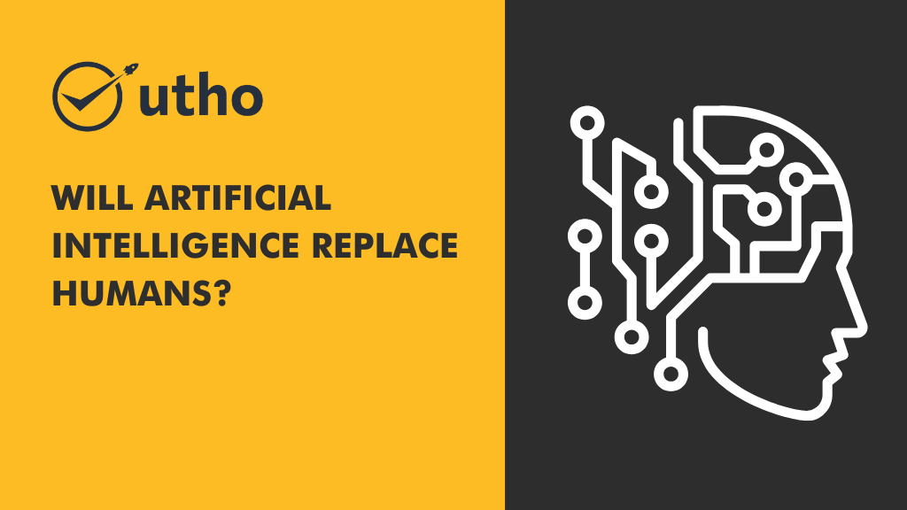
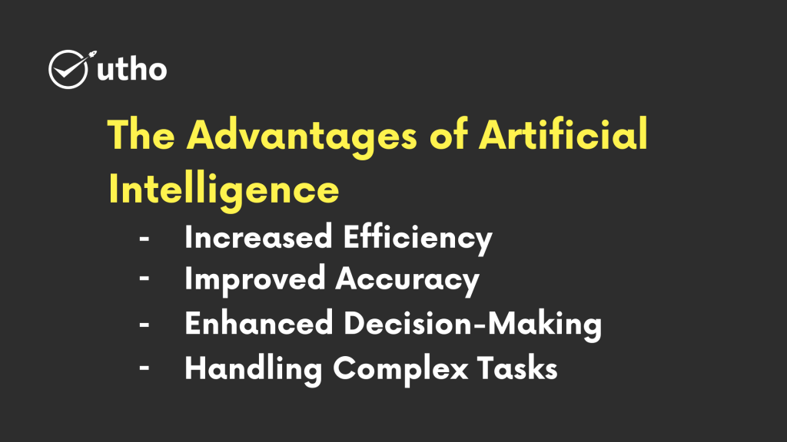
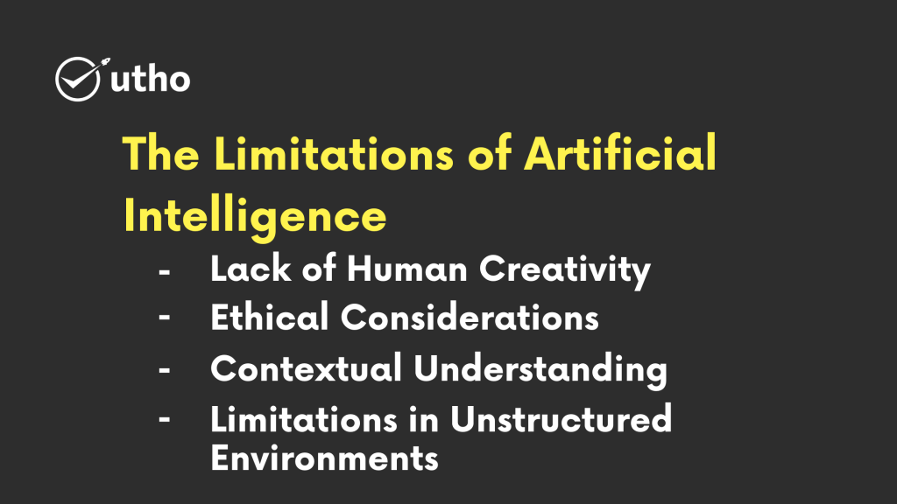

## Introduction

In the ever-evolving world of technology, the emergence of artificial intelligence (AI) has sparked intriguing discussions about its potential to replace human workers. This article aims to shed light on this thought-provoking question, exploring both the advantages and limitations of AI technology. We will delve into this topic in a user-friendly manner, providing valuable insights for better understanding.

## Understanding Artificial Intelligence

Artificial intelligence refers to the development of computer systems capable of performing tasks that typically require human intelligence. AI systems are designed to analyze data, recognize patterns, make decisions, and even learn from experience. With advancements in machine learning and deep learning algorithms, AI has made significant strides in various domains.

## The Advantages of Artificial Intelligence

### Increased Efficiency

AI technologies have the potential to automate repetitive and mundane tasks, freeing up human workers to focus on more complex and strategic activities. This enhances overall productivity and efficiency across industries.

### Improved Accuracy

AI algorithms excel at processing vast amounts of data with precision and accuracy, minimizing human errors and providing more reliable results. This is particularly beneficial in fields such as healthcare, finance, and manufacturing, where accuracy is crucial.

### Enhanced Decision-Making

AI systems have the capability to analyze extensive data sets and provide valuable insights to support decision-making. By considering numerous factors and patterns, AI can assist humans in making informed choices, leading to better outcomes.

### Handling Complex Tasks

AI is adept at tackling complex tasks that involve processing massive datasets and performing intricate calculations. This capability has significant implications in scientific research, data analysis, and problem-solving.

## The Limitations of Artificial Intelligence

### Lack of Human Creativity

While AI can process data and generate insights, it currently lacks the creative and innovative thinking that humans possess. Tasks that require intuition, emotional intelligence, and artistic expression are still better suited to human capabilities.

### Ethical Considerations

The adoption of AI raises ethical concerns regarding data privacy, bias in decision-making algorithms, and potential job displacement. Addressing these ethical implications is vital to ensure fairness, transparency, and accountability in AI development and deployment.

### Contextual Understanding

AI systems struggle to comprehend complex human emotions, nuances of language, and cultural contexts. Professions that involve customer service, counseling, and interpersonal communication rely on human interaction and empathy.

### Limitations in Unstructured Environments

While AI excels in structured environments with well-defined rules, it can face challenges when confronted with unstructured situations or unexpected events. Humans possess adaptability and critical thinking skills necessary for such scenarios.

## The Future of AI and Human Collaboration

Rather than entirely replacing humans, AI is more likely to augment human capabilities and reshape the nature of work. Collaborative efforts between humans and AI systems can unlock new possibilities and drive innovation across industries. By leveraging AI to automate routine tasks and enhance decision-making, humans can focus on higher-value activities that require creativity, empathy, and complex problem-solving.

## Utho Cloud: Embracing the Power of AI

Utho Cloud recognizes the transformative potential of AI and provides innovative solutions to help businesses harness its benefits. As a leading provider of AI-driven technologies, Utho Cloud empowers organizations to optimize their operations, make data-driven decisions, and achieve their business objectives. To learn more about Utho Cloud and their AI offerings, visit their website at [utho.com](https://utho.com/).

In conclusion, while artificial intelligence has the potential to automate certain tasks and improve efficiency, it is unlikely to completely replace humans. The collaboration between AI and human intelligence will shape the future of work, leading to new opportunities and advancements across industries.

**Read Aslo:** [How to Configure FTP Server on Windows Server 2019](https://utho.com/docs/tutorial/how-to-configure-ftp-server-on-windows-server-2019/)
