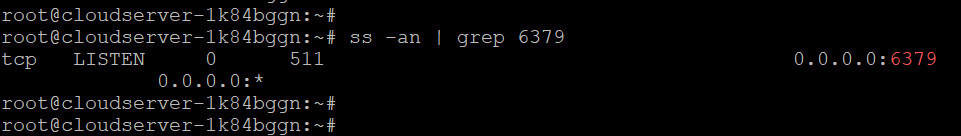

## Introduction

In this article, you will learn how to install and configure Redis on Ubuntu 22.04.

[Redis](https://en.wikipedia.org/wiki/Redis) is a data structure that is stored in memory and functions similarly to a store. It can be used as a cache, streaming engine, or database. Redis makes it possible for developers to save data in their programmes using straightforward statements rather than the more complicated query language often required.

Redis has support for a wide variety of data structures, including strings, hashes, sets, and many others. In addition to that, it gives you access to the Replication features as well as the Redis cluster, which gives you automatic partitioning.

## Installation of Redis

**Before downloading any package from the default repository, it is recommended that the operating system be brought up to date first:**

```
# apt update

```

**Use the command that is mentioned below in the following manner in order to install the most recent version of Redis-server from Ubuntu's repository:**

```
# apt install redis-server -y

```

**Check the status of the "Redis" server using the following command to determine whether or not the installation was successful:**

```
# systemctl status redis-server

```


**In order to verify that the installation was successful, we will use the following command to check the version of Redis:**

```
# redis-server -v

```


## Configuration of Redis

**In order to use the Redis server, you will need to configure it such that it can be used on Ubuntu.**

##### Step 1: Activate the Redis Service Right Away

**The very first and most important step in dealing with any server is to activate its services so that the service will be enabled regardless of whether or not the server is rebooted:**

```
# systemctl enable --now redis-server

```


##### Step 2: Redis should be allowed to listen on all network interfaces

**Redis does not allow remote connections of any kind, and it will only answer to the requests that come from a local host or the system that it is being used on. Additionally, it is essential to link the database to the same computer as the rest of the system.**

**Let's say you wish to make it possible for other distant connections to establish a connection to Redis. In this scenario, you will need to adjust the configuration of "Redis" so that it listens to addresses other than the localhost:**

**In order to accomplish this, we will access the configuration file for Redis by using the vi editor to execute the following command:**

```
# vi /etc/redis/redis.conf

```

**Locate the line in the file that begins with "bind" and replace it with the line that is seen in the figure:**


##### Step 3: Change the password for Redis.

**Look for the line that says "requirepass" in the file "/etc/redis/redis.conf" and then write your password in front of it:**


**In order for the modifications to take effect, the "Redis" server must be restarted.**

```
# systemctl restart redis-server

```

##### Step 4: Check that the Changes were Made

**Check that Redis is still listening on port "6379" after you've made the adjustments described above:**

```
# ss -an | grep 6379

```



**After this, all TCP traffic should be permitted to pass through port "6379":**

```
# ufw allow 6379/tcp

```


##### Step 5: You can get the Redis CLI here

**Now that all of the configurations have been finalised, run the following command to access the "Redis CLI":**

```
# redis-cli

```


**Authorise your identity by using the "AUTH" keyword in the configuration file, along with the password that you set in previous steps (step 3):**

```
# AUTH <password>

```


**Ping the Redis to ensure that it is operating properly:**

```
# ping

```


**Use the following command to exit the Redis Command Line Interface:**

```
# quit

```


## Conclusion

Hopefully, now you have learned how to install and configure Redis on Ubuntu 22.04.

**Also Read:** [How to Install NGINX Web Server on Ubuntu 22.04 LTS](https://utho.com/docs/tutorial/how-to-install-nginx-web-server-on-ubuntu-22-04-lts/)

Thank You 🙂
