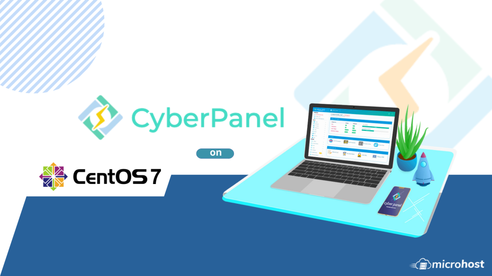

**Introduction**

CyberPanel is an open-source and free web hosting control panel powered by OpenLiteSpeed. It helps reduce resource usage as a performance benefit. This is why CyberPanel is different from other control panels. Cyberpanel is available both in free and enterprise versions. OpenLiteSpeed is used by the free version, and the enterprise version uses LSWS.

  
**How to Install**

**Step 1: Login to your server via SSH**


**Step 2: Firstly, update the packages installed on your system by running:  
**  
```
 # yum update –y 
```  

**Step 3: Since CyberPanel is free, you do not have to prepare any kind of license, and you can install it using the following command:**

```
 # sh <(curl `[https://cyberpanel.net/install.sh](https://cyberpanel.net/install.sh)` || wget `-O - [https://cyberpanel.net/install.sh](https://cyberpanel.net/install.sh)`) 
```


**Step 4: Next you will see "CyberPanel Installer v2.1.1".  
**Press **1** and hit enter.  


**Step 5: Now, the installer will show you the RAM and disk requirements to install CyberPanel**

Press **1** and hit enter to install CyberPanel with **OpenLiteSpeed**


**Step 6: Next comes a prompt to install the full service for CyberPanel, which includes PowerDNS, Postfix, and Pure-FTPd.**

Press **y** and hit enter


**Step 7: Next comes a prompt to setup Remote MySQL.**

Press **n** and hit enter.


**Step 8: Next comes a prompt to select the version of the CyberPanel that you want to install.**

Just hit enter to continue with the latest version.


**Step 9: Next comes a prompt to choose a password.**

You can choose the default password, a randomly generated password or specify the admin password

You can press **d** to choose the default password (which is **1234567**)

Or you can press **r** to choose a randomly generated password

Or you can press **s** to specify the admin password

In this article, we’re choosing the **default password**. So, we will press **d** and hit enter

The admin password will be set to **1234567.**


**Step 10: Next comes a prompt to install the Memcached process and its PHP extension.**

Press **Y** and hit Enter.


**Step 11: Next comes a prompt to install the Redis process and its PHP extensions.**

Press **y** and hit Enter.


**Step 12: Next it will ask if you want to kill the watchdog.**

Press **Y** (capital Y)and hit enter

Installation will begin.


**Step 13: After the installation is complete, it will ask you to restart the server.**

Press y and hit enter to restart the server


Putty closes once you restart the server.

**Step 14: Access your CyberPanel by hitting Your\_Server\_IP:8090 in your browser.  
**


Use default login credentials.

Enter username: admin

Enter password: 1234567


You’ve entered your CyberPanel.


**How to configure Firewall on CyberPanel**

Firewall rules define what type of Internet traffic is allowed or blocked. You can verify the OS firewall and the Vultr firewall are both open for inbound and outbound on the following ports:

1\_ TCP: 8090 for CyberPanel

2\_ TCP: 80, TCP: 443, and UDP: 443 for the webserver

3\_ TCP: 21 and TCP: 40110-40210 for FTP

4\_ TCP: 25, TCP: 587, TCP: 465, TCP: 110, TCP: 143, and TCP: 993 for mail service

5\_ TCP: 53 and UDP: 53 for DNS service

Thank you.
