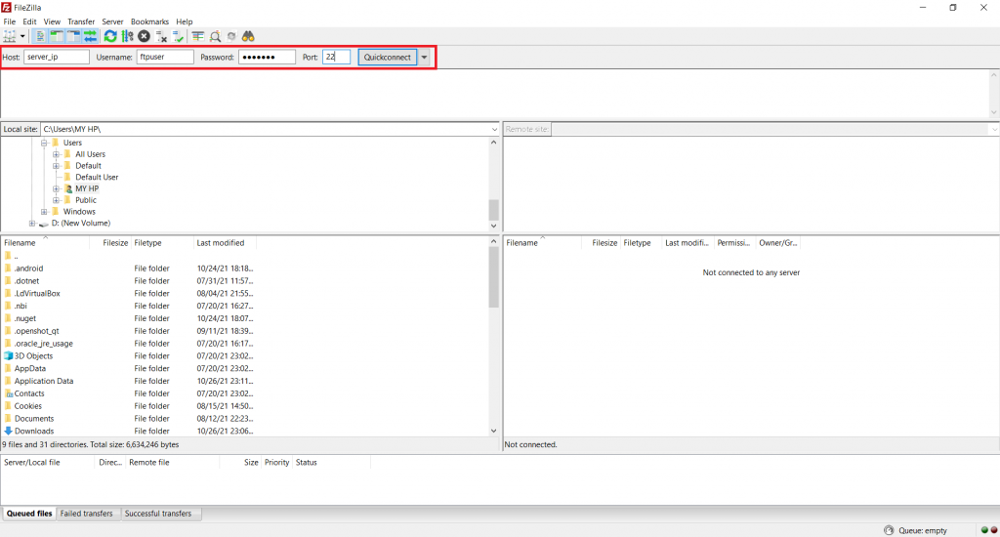

**Step 1.**  Login to your server via SSH Putty


**Step 2.**  Install the vsftp (Very Secure File Trasnfer Protocol) Package :

```
 # yum install vsftpd -y 
```

**Step 3.** Open the configuration file of vsftp server and disable anonymous access by default ftp is set to anonymous access:

```
 # vi /etc/vsftpd/vsftpd.conf 
```

Change the following values to the value shown below:

```
 **anonymous_enable=NO** 
```

Add the following parameters in the end of the file. these two parameters will provide security to your ftp server.

```
 **chroot_local_user=YES**  
**allow_writeable_chroot=YES** 
```

```
 Save and Exit  
:wq 
```

**Step 4.**  Create user for ftp access

```
 # **useradd ftpuser** 
```

```
 # **passwd ftpuser** 
```

**Step 5.**  Start and enable the service

```
 # **systemctl start vsftpd** 
```

```
 # **systemctl enable vsftpd** 
```  

**Step 6.**  Apply the firewall rule

```
 # firewall-cmd --permanent --zone=public --add-service=ftp 
```

```
 # firewall-cmd --reload 
```

**Step 7.** Set selinux boolean on “ftpd\_full\_access”

```
 # **setsebool -P ftpd_full_access on** 
```  

**Step 8.**  Open Filezilla Client 


**Step 9.**  type in your login details as follows:  
Your\_server\_ip in 'Host'  
ftp\_username in 'Username'  
ftp\_password in 'Password'  
SSH\_port in 'Port'  
And hit 'Quickconnect'



**Step 10.**  You have now connected to your server.


Thank You
