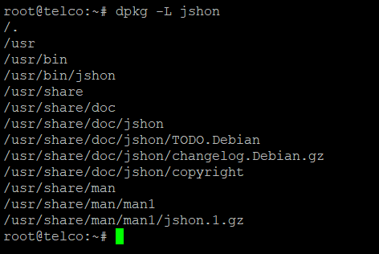

**Description**

In this article, we will acquire new knowledge. How to Install Jshon on [Ubuntu](https://en.wikipedia.org/wiki/Ubuntu) 20.04 JSON is a free and open-source command-line utility that can be used to read, generate, and parse JSON documents. It is designed to be a replacement for all of the unstable JSON parsers that are made from grep, sed, and awk, in addition to the heavyweight one-line parsers that are made from Python and Perl. You can load data into Jshon from a file or from the standard input, then execute actions on the data, and finally display the result on the standard output. It is very simple to use and simple to operate with. Additionally, it can be installed on virtually all of the most common operating systems, including Linux. In this section, we are going to examine the procedures required to install Jshon on computers running Ubuntu 20.04 LTS.

Learn more by following the instructions below How to Install Jshon on [Ubuntu](https://utho.com/docs/tutorial/explanation-of-less-more-and-most-command-in-linux/) 20.04.

## Step 1: Update Server

install all the available updates and then update the packages to the current version by using the sudo apt update and sudo apt upgrade commands, as shown below.

```
apt update && sudo apt upgrade
```


## Step 2: Install Jshon

Using the instruction sudo apt install jshon, which will be demonstrated below, you will be able to install the jshon utility from the default repository that comes with Ubuntu. The program, as well as all of its dependencies, will be downloaded and installed as a result of this action.

```
sudo apt install jshon
```


## Step 3: Check Version

After the installation has been completed successfully, you will be able to verify the utility version by utilising the jshon --version program, as is demonstrated below.

```
jshon --version
```


## Step 4: Verify Installation

You can examine and double-check the installed file path by using the dpkg -L jshon command, as is demonstrated in the following example.



I really trust that you have followed each step in this process very carefully (How to Install Jshon on Ubuntu 20.04).

Must read :- [https://utho.com/docs/tutorial/how-to-add-a-user-and-grant-root-privileges-on-ubuntu-18-04/](https://utho.com/docs/tutorial/how-to-add-a-user-and-grant-root-privileges-on-ubuntu-18-04/)

**ThankYou**
