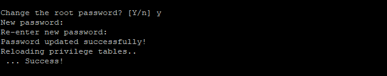

## Introduction

In this article you will learn how to install MariaDB 10.7 on Centos 7

This is to install the latest MariaDB on a CentOS server. MariaDB is a database management system that is a fork of MySQL. It is extremely similar to MySQL, which is a database management system. Several different applications, including data warehousing, e-commerce, enterprise-level features, and logging programmes, all make use of the MariaDB database.

[MariaDB](https://en.wikipedia.org/wiki/MariaDB) will let you to fulfil all of your burden in an effective manner; it can function in any cloud database and can function at any scale, whether it be little or huge.

A database is a repository for information that can be easily retrieved and applied in the context in which it is required. When compared to recording information on a piece of paper or in a Word document, storing all of your information in a database allows it to be organized into tables, making it simple to retrieve each individual entry in a manner that is both systematic and accurate.

## Step 1: Add MariaDB YUM repository

There is a MariaDB YUM repository available for systems that are based on RHEL, and it may be added to the system by executing the following commands:

```
# curl -LsS -O https://downloads.mariadb.com/MariaD B/mariadb_repo_setup
```

```
# sudo bash mariadb_repo_setup --mariadb-server-ver sion=10.7
```

The script that was run automates the process of configuring MariaDB repositories for YUM as well as the importation of the necessary GPG keys.

By showing all of the accessible repositories, we will be able to determine whether or not the repository was successfully added.

```
# sudo yum makecache
```

```
# sudo yum repolist
```

## Step 2: Install MariaDB 10.7 on CentOS 7

Following the installation of the repository, we are able to move forward with the installation of MariaDB 10.7 on CentOS 7.

```
# sudo yum install MariaDB-server -y
```

Using the rpm command, you are able to obtain more information about the currently installed version of the MariaDB database.

```
# rpm -qi MariaDB-server
```


## Step 3: Start and Secure MariaDB 10.7 on CentOS 7

After the success of a successful installation, let's set the database service up and running:

```
# sudo systemctl enable --now mariadb
```

Confirm status is running;

```
# systemctl status mariadb
```


It is useful to verify the version of the Client by using the following command:

```
# mariadb -V
```


Run the mariadb-secure-installation script, which assists you in protecting your MariaDB database server.

```
# sudo mariadb-secure-installation
```

Enter current password for root (enter for none): Press Enter


Switch to unix\_socket authentication \[Y/n\] : Press y


Change the root password? \[Y/n\] : Press y



Remove anonymous users? \[Y/n\] : Press y


If you choose you wish to let root login remotely, then press the y key; otherwise, press the n key.


Remove test database and access to it? \[Y/n\] : Press y


Reload privilege tables now? \[Y/n\] : Press y


A username and password combination should be required in order to access the MariaDB shell.

```
# mysql -u root -p
```


```
# CREATE DATABASE microhost;
```

```
# SHOW DATABASES;
```


Executed the following command To make changes take effect without reloading or restarting mysql service, you can use the flush privileges command to reload the grant tables in the database.

```
# FLUSH PRIVILEGES;
```

```
# exit
```


## conclusion

Hopefully, you have learned how to install how to install MariaDB 10.7 on centos 7.

Also Read: [How To Install Docker on Centos 7](https://utho.com/docs/tutorial/how-to-install-docker-on-centos-7/)

Thank You 🙂
