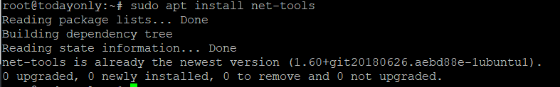

<figure>


<figcaption>

How to Install netstat on Ubuntu 20.04 LTS

</figcaption>

</figure>

**Description**

instructions on how to instal netstat on a computer running [Ubuntu](https://en.wikipedia.org/wiki/Ubuntu) 20.04 LTS. netstat is a utility that can be run from the command line that provides statistics about ports and protocols. It is possible to use it to display the current state of TCP and UDP endpoints in table format, as well as information regarding routing tables and interfaces. It is a highly well-known programme that is predominantly utilised by Unix and Linux administrators all over the world to troubleshoot any port and network interface problems that may arise.

Because it is distributed as a component of the Net Tools package, the installation of this tool requires that the Net Tools package itself be installed first. However, for the purpose of this tutorial, we will focus on installing netstat on Ubuntu 20.04 LTS because its installation is quite straightforward across the majority of Linux distributions.

## Update Your Server

Use sudo apt update and sudo apt upgrade before installing a new package in the system to sync the system packages with the most recent available updates from the Ubuntu repo.

```
sudo apt update && sudo apt upgrade
```


## Install Netstat

Using the command sudo apt instal net-tools, you can download and instal the netstat programme that is included in the default Ubuntu repository. The package, as well as any and all of its dependencies, will be downloaded and installed as a result of this action.

```
sudo apt install net-tools
```


## Check Version

If the installation went well, you can use the netstat —version command to check the version that was installed.

```
netstat --version
```


## Check Installation

Using the dpkg -L net-tools command, you can also check the installed file path.

```
dpkg -L net-tools
```


## Use of netstat

Let's make use of the fact that the netstat tool has been successfully installed by listing the current status of TCP ports using it.

```
sudo netstat -ntlp
```


## More info of netstat

```
netstat --help
```


I sincerely hope that you have a complete understanding of everything

**Must Read** : [Convert rwx permissions to octal format in Linux](https://utho.com/docs/tutorial/convert-rwx-permissions-to-octal-format-in-linux/)
