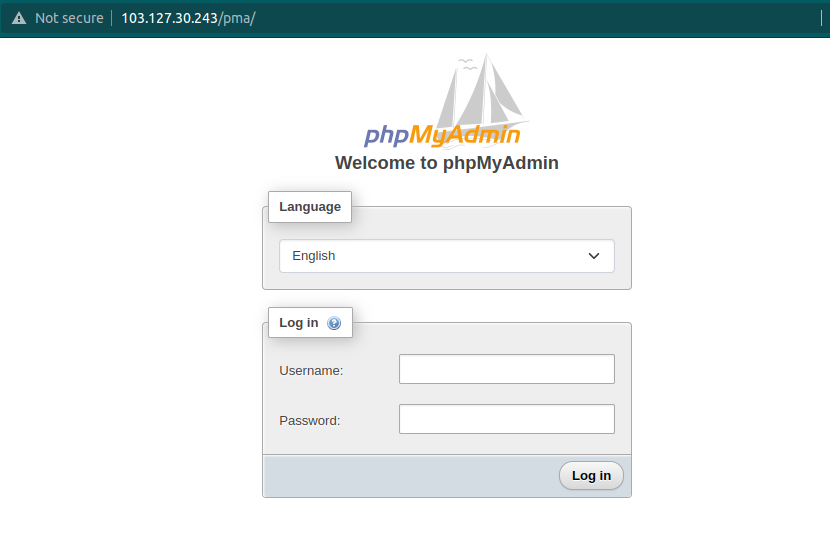

<figure>


<figcaption>

How to install phpMyAdmin on Linux

</figcaption>

</figure>

## Description

In this tutorial, we will see how to install phpMyAdmin on Linux. Many users need the features of a database management system like MySQL, but they may not feel comfortable interacting with the system only from the MySQL prompt.

phpMyAdmin was made so that people could use MySQL through a web interface.

## Prerequisites

1. Super user( root) or any normal user with SUDO privileges.
2. wget command
3. LAMP installed on the Ubuntu machine( [Install LAMP on Ubuntu](https://utho.com/docs/tutorial/how-to-install-lamp-on-ubuntu-18-10/))

## Installation of phpMyAdmin

Step 1: First copy the download link of the desired phpmyadmin version from the [official site](https://www.phpmyadmin.net/downloads/) of phpmyadmin.


Step 2: Now download the phpmyadmin on your server.

```
 wget https://files.phpmyadmin.net/phpMyAdmin/5.2.0/phpMyAdmin-5.2.0-all-languages.tar.gz 
```

Step 3: Now extract the content from the newly downloaded phpmyadmin .gz file.

```
 tar -xjv tar -xzf phpMyAdmin-5.2.0-all-languages.tar.gz 
```

Step 4: Now move you phpmyadmin folder to the default document root path of the server( /var/www/html)

```
 mv phpMyAdmin-5.2.0-all-languages /var/www/html/pma 
```

Step 5: Now go to your browser and search - serverip/pva



This is it. You have successfully installed the phpmyadmin in just 5 simple steps !!!

Also Read: [How to check and analyze packets by tcpdump command](https://utho.com/docs/tutorial/how-to-check-and-analyze-packets-by-tcpdump-command/), [How to install Composer on Ubuntu 20.04](https://utho.com/docs/tutorial/how-to-install-composer-on-ubuntu-20-04/)
