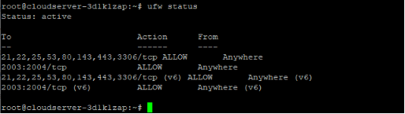

## Introduction

In this article we will discuss about How to Install Webuzo on Debian, [Webuzo](https://webuzo.com/) is a control panel for multi-user shared hosting that enables users to deploy various apps and share server resources with other users simultaneously. In addition, the control panel provides an interactive management interface that makes it possible to install applications, manage domains, schedule jobs, build databases, and manage users without having any prior experience or knowledge of technical administration.

This tutorial will describe how to install Webuzo on a server that has been freshly installed with Debian

## Step 1: Install Webuzo

Webuzo provides a straightforward installation script that we can use to set up the control panel and choose which system services we would also like to set up along with it.

1\. To install Webuzo, download the installation script.

```
# wget http://files.webuzo.com/install.sh
```

2\. Make the script executable by modifying its permissions so that it can be run.

```
# chmod 700 install.sh
```

3\. Start the installation of Webuzo by running the script in the directory.

```
# ./install.sh --v3
```


## Step 2: Configure Uncomplicated Firewall (ufw)

Allowing access to only Webuzo ports and important service ports like HTTP, HTTPS, and MySQL, which are utilised by hosted apps the majority of the time, can help you secure your server. Do not open port 21, for instance, if you do not intend to send data via the File Transfer Protocol (FTP).

1\. Allow the essential ports.

```
# ufw allow 80,443,3306,21,22,53,25,143/tcp
```

2\. Open the Webuzo ports.

```
# ufw allow 2003:2004/tcp
```

3\. Due to the fact that ports 2002 and 2005 are alternatives, this article restricts Webuzo to only ports 2003 and 2004.

4\. Confirm the new rules that have been added to your firewall table.

```
# ufw status
```



We may proceed with the configuration of the web control panel now that Webuzo has been installed correctly and the server's panel ports have been opened.

In a web browser, navigate to the location of your server on port 2004.

```
http://SERVER-IP:2004
```


## Conclusion

Congratulations, Webuzo has been successfully installed on a server running Debian . Build shared hosting packages on a single server with the help of this control panel, and set up web applications that can be accessed by several users at the same time.

Read **[How to Install Webuzo on Fedora](https://utho.com/docs/tutorial/how-to-install-webuzo-on-fedora/)**

Thank You 🙂
