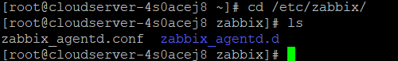
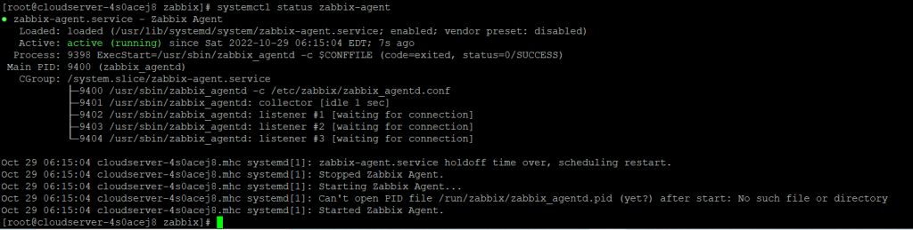

**Description**

When a native Zabbix agent is built in the C programming language, it has the capability of running on a variety of supported platforms, such as Linux, UNIX, and Windows, and collecting data from a device about its CPU consumption, memory usage, disc usage, and network interface usage.

The Zabbix Agent Installation Guide for CentOS 7. This is the Zabbix agent, and it collects all data by using the agent's configuration file. So let's get started with this instruction for step by step, shall we?

## Add an RPM repository for the Zabbix agent installation.

```
 # rpm -Uvh [https://repo.zabbix.com/zabbix/4.0/rhel/7/x86_64/zabbix-release-4.0-1.el7.noarch.rpm](https://repo.zabbix.com/zabbix/4.0/rhel/7/x86_64/zabbix-release-4.0-1.el7.noarch.rpm) 
```


## After that, run the install command.

```
# yum install zabbix-agent -y 
```


## Then open the configuration file that is located below.

```
# cd /etc/zabbix/ 
```



## open the above mentioned file using vi command.

```
# vi zabbix_agentd.conf 
```


## now insert the below content into the zabbix agentd.conf file using vi.

```
 PidFile=/var/run/zabbix/zabbix_agentd.pid  
LogFile=/var/log/zabbix/zabbix_agentd.log  
LogFileSize=1024  
Server=103.127.29.54, 89.47.59.30

```
ServerActive=127.0.0.1
```
Hostname=ssd14blrxc  
Include=/etc/zabbix/zabbix_agentd.d/*.conf 
```


Then, hit Esc to save, followed by typing :wq and pressing Enter to finish.

Start the zabix agent service by entering the following command.

```
# systemctl enable zabbix-agent 
```


## Check status using below command.

```
# systemctl status zabbix-agent 
```



**Conclusion**

Zabbix is a piece of open source software that may be used as a monitoring tool for a variety of IT components, such as networks, servers, virtual machines (VMs), and cloud services. Monitoring indicators like as network use, CPU load, and disc space consumption are made available via Zabbix.When a native Zabbix agent is built in the C programming language, it has the capability of running on a variety of supported platforms, such as Linux, UNIX, and Windows, and collecting data from a device about its CPU consumption, memory usage, disc usage, and network interface usage.

What are the features of Zabbix?

Zabbix is compatible with a wide variety of protocols, making it suitable for the remote monitoring of services.

- Web monitoring.
- Scriptable synthetic monitoring.
- SNMP (v1/2c/3) polling and trapping.
- Java application monitoring.
- IPMI.
- SSH/Telnet checks.

**Thank You**
