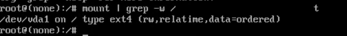

Firstly, you need to **power on** or **reboot** your **Ubuntu** system. You should get a grub menu as shown below.


Next, press the `'e'` key to edit the grub parameters. This should display a screen as shown below.


Scroll down until you get to the line that begins with `'linux /boot/vmlinuz'` the entire line is highlighted below. Narrow down to a section that reads `"ro quiet splash $vt_handoff"`.


Replace "ro ifnames=0 biosdevname=0" with "rw init=/bin/bash" as shown. The purpose is to set the root file system with **read** and **write** commands denoted by the `rw` prefix.


Thereafter, press `ctrl + x` or `F10` to **reboot** your system. Your system will boot into a root shell screen as shown below. By running the command you can confirm that the root filesystem had access rights to read and write.

```
mount | grep -w /
```

The output in the screenshot below confirms **read** and **write** access rights denoted by `rw`.



To reset the root password execute the command.

```
passwd
```

Provide a new password and confirm it. Thereafter, you will get a ‘**password updated successfully**’ notification.


With the root password successfully changed, **reboot** into your **Ubuntu** system by running the command.

```
exec /sbin/init
```

Thankyou.
