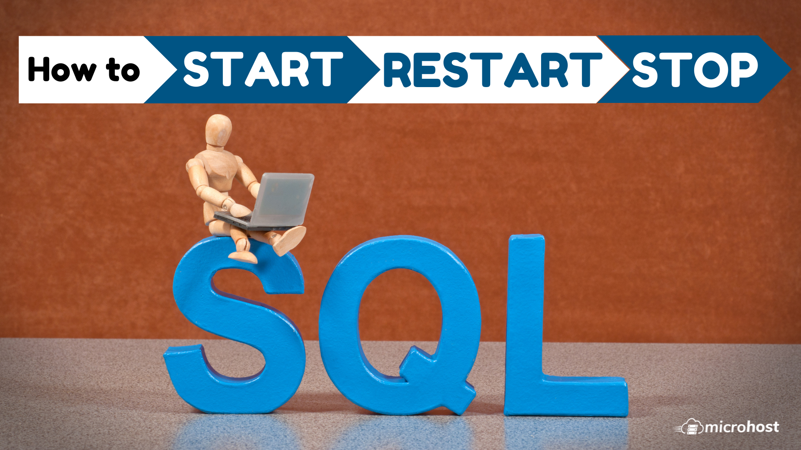

## Introduction

[MySQL](https://en.wikipedia.org/wiki/MySQL) is **a database management system**. This article will show you how to start, stop, and restart MySQL Server on [CentOS 7](https://utho.com/docs/tutorial/how-to-install-php-7-4-in-centos-7/), It may be anything from a simple shopping list to a picture gallery or the vast amounts of information in a corporate network. To add, access, and process data stored in a computer database, you need a database management system such as MySQL Server.

One of the most well-known and widely used open-source relational databases is called MariaDB Server. It is made by the people who created MySQL in the first place, so you know it will always be open source. It is included in the majority of cloud providers and comes pre-configured in the majority of Linux versions.

It is founded on the values of performance, openness, and stability, and the MariaDB Foundation promises that contributions will be accepted based on the strength of their technical content. Recent additions to the capabilities include compatibility features with Oracle Database, enhanced clustering with Galera Cluster 4, and Temporal Data Tables, which make it possible to query the data as it existed at any point in time in the past.

You have to **[Install MySQ](https://utho.com/docs/tutorial/how-to-install-mariadb-10-7-on-centos-7/)**[**L**](https://utho.com/docs/tutorial/how-to-install-latest-mysql-5-7-on-centos-7/) by using the below article.

We will stop the service of MySQL with the following command.

```
# systemctl stop mysqld
```

We will start the service of MySQL with the following command.

```
# systemctl start mysqld
```

We will restart the service of MySQL with the following command.

```
# systemctl restart mysqld
```

We can check the status of MySQL with the following command.

```
# systemctl status mysqld
```


Hopefully, this article have guide you how to start, stop, and restart MySQL Server on [CentOS 7](https://utho.com/docs/tutorial/how-to-install-php-7-4-in-centos-7/).

Thank You 🙂
