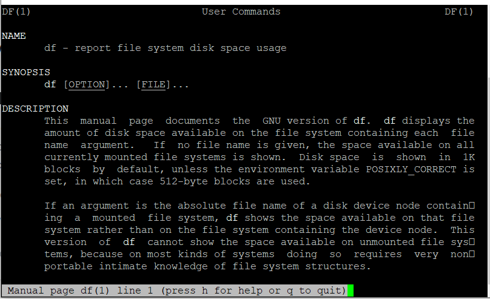

## **Description**

In this article you will know How you can View Colored Man Page in linux. In computer operating systems that are similar to [Unix](https://en.wikipedia.org/wiki/Unix), the phrase "man page" refers to the documentation that is associated with a terminal-based application, tool, or utility (commonly known as a command). It includes the name of the command, the syntax for using it, an explanation of the possible options, the author, copyright information, related commands, and other information.

The following is an example of how to view the manual page for a command in [Linux](https://utho.com/docs/tutorial/category/linux-tutorial/); this will display the man page for the df command:

```
# man df 
```



The output of the man programme is typically formatted with the help of a terminal pager software such as more or less, and the default display for any kind of text is typically in white colour (bold, underlined etc..).

\*You may get nicely coloured man pages by making simple adjustments to the.bashrc file in your home directory by defining a colour scheme using a variety of LESS TERMCAP variables.

```
# vi ~/.bashrc 
```

- Add the following to your colour scheme.

```
 export LESS_TERMCAP_mb=$'e[1;32m'  
export LESS_TERMCAP_md=$'e[1;32m'  
export LESS_TERMCAP_me=$'e[0m'  
export LESS_TERMCAP_se=$'e[0m'  
export LESS_TERMCAP_so=$'e[01;33m'  
export LESS_TERMCAP_ue=$'e[0m'  
export LESS_TERMCAP_us=$'e[1;4;31m' 
```

The colour codes that were utilised in the setup that was just shown are shown below.

- 31 – red
- 32 – green
- 33 – yellow

And here are the meanings of the escape codes that were utilised in the setup that was just presented:

- 0 – reset/normal
- 1 – bold
- 4 – underlined

In addition to this, you can restart your terminal by typing reset, or you can switch to a different shell. Now when you try to see a man page for the df command, it should look like this instead of the default view. This view is much nicer.

```
# man df 
```


You might also use the MOST paging application, which is compatible with operating systems that are similar to Unix and enables you to scroll both left and right as well as supporting multiple windows.

```
# yum install most 
```

After that, you should include the following line in your /.bashrc file, then source the file as you did before and maybe reset your terminal.

In this article, we demonstrated how to colourize the man pages in Linux so that they look more appealing. Make use of the comment box down below to ask any questions you may have, as well as to contribute any helpful hints or techniques regarding the Linux shell.

## **Thank You**
