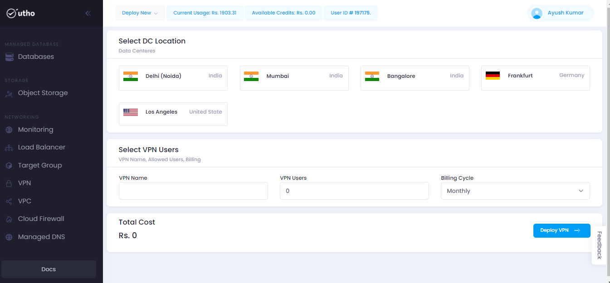

# VPN
--- 
Also known as a Virtual Private Network, a VPN establishes an encrypted connection via the Internet between a device and a network. This encryption is key in securely transmitting sensitive data, preventing unauthorized individuals from intercepting the traffic. Moreover, a VPN enables users to work remotely, providing a secure means of conducting tasks from a distance. Notably, VPN technology finds extensive usage within corporate environments.

### Why Consider Using a VPN?
When your browser connects to a web server, it first checks with Domain Name Services (DNS) servers to find the server's IP address. While most connections are encrypted using SSL/TLS, there are still vulnerabilities, especially on public Wi-Fi networks. For example, a skilled attacker could weaken the encryption protocol, making communications vulnerable to brute-force attacks.

Using a VPN adds an extra layer of security to the connection. The VPN service encrypts data and sends it across the network. As a result, the targeted server sees the VPN's public IP address instead of the user's. If there's a hijacked connection and someone tries to eavesdrop, strong VPN encryption prevents potential brute-force attacks, protecting data from exposure in an insecure environment.

### What does a VPN (virtual private network) do?

Instead of connecting directly to the internet, your web traffic is routed through a VPN server. This process conceals your IP address, making it appear as though your web activity originates from your VPN service provider's network rather than your actual location. This additional layer of protection between your device, whether it's a computer or smartphone, allows you to browse and use the internet securely and with enhanced privacy.

### Advantages of Using a VPN:
VPNs offer users and organizations several benefits, including:

- **Secure Connectivity:** VPNs encrypt connections, ensuring that third parties cannot intercept data without the encryption keys.
- **Streamlined Distributed Networks:** Site-to-site VPNs create a virtual link between networks, allowing them to use private IP addresses for internal traffic, simplifying network management.
- **Access Control:** VPNs enable remote users to access internal resources securely, as the VPN endpoint is within the network firewall, allowing authorized access without exposing resources to the public.

### Approach to Setting Up a VPN:
---

**Step 1:** Click on the provided link [Console](https://console.utho.com/) URL.Upon logging in to the platform, this link will redirect you to the Dashboard.

 

**Step 2:** On the Databases tab, two access options are available:
- "Deploy new" (from the dropdown menu)
- Left-hand side (LHS) tab

**Step 3:** Selecting either option will direct you to the VPN homepage.

**Step 4:** On the homepage, two options for creating the VPN are provided.

**Step 5:** Upon selection, you'll be redirected to the next page to specify details according to your requirements.

**Step 6:** Choose the Data Center (DC) Location based on your needs.

**Step 7:** Select the VPN users, name, and billing cycle as indicated.

Click on "Deploy VPN" to initiate the deployment process.

A bill will be generated; proceed to payment by clicking "Pay."

Select the desired mode of payment.

Once payment is completed, the VPN will be deployed, and you will receive an email with the invoice details.

---
**THE END**
