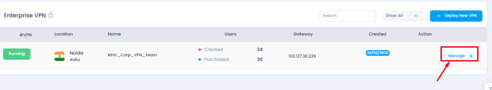
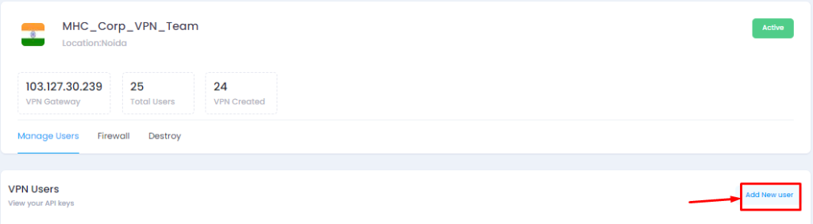

A **virtual private network** (VPN) gives you online privacy and anonymity by creating a private network from a public internet connection. VPNs mask your internet protocol (IP) address so your online actions are virtually untraceable.

1\. At first, Access [Microhost cloud platform](https://cloud.microhost.com/)

2\. Now click on VPN option and **Create VPN**

3\. Select DC Location and Enter VPN name, number of users, billing cycle after that click on Deploy

4\. Once you click on deploy VPN it will redirect you to the payment page. After the payment, VPN would be created and ready to use. Now click on **Manage VPN** option from action section. 

5\. Now from **Add user** section you can create vpn user. 

6\. After adding users you can see user details from the manage user section and download the ovpn file after clicking on download option.   

7\. Now you need to download the open vpn client connect 

a) For windows [https://openvpn.net/downloads/openvpn-connect-v3-windows.msi](https://openvpn.net/downloads/openvpn-connect-v3-windows.msi)

8\. After downloading and installing, you can see the openvpn shortcut on your desktop. run openvpn client, it will ask for the URL import and file import option, You need to select the file import option and import ovpn file which you downloaded.

  

9\. After importing the ovpn file, you will see the message “profile imported successfully”. you have to add a profile and connect vpn.

10\. Once you import and add profile. You will be able to see the connect option.

Thank you.
