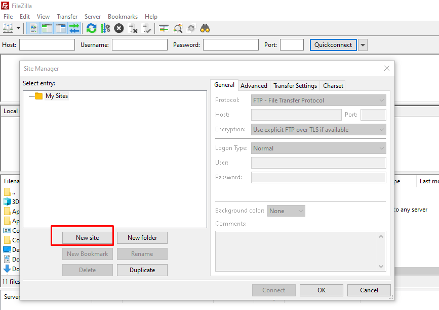
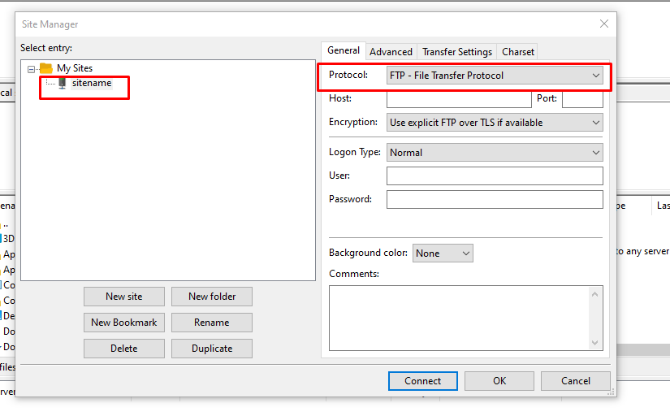

In this tutorial, we will learn how to connect a Linux server with SFTP using FileZilla client.

You need to enable SFTP or SSH access in your Microhost cloud server before logging in to [SFTP](https://utho.com/docs/tutorial/how-to-configure-sftp-server-in-debian/).

1\. Open **[FileZilla](https://filezilla-project.org/download.php)**

2\. Click on `file` tab on top in FileZilla.

3\. After that click file open `site manager` and click on `new site`.

4\. Open new site and set `site name`(For Eg:- site1) and change `protocol` from `FTP` to `SFTP`.

5\. Enter your `server ip or hostname` in host field and `username and password`(root user or normal user which one you have assigned to your website folder) and click on `connect.`

Thankyou..
