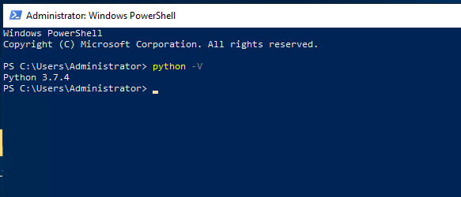

## INTRODUCTION how to install Python 3.7 on Windows Server

**[Python](https://en.wikipedia.org/wiki/Python_(programming_language))** is a high-level, general-purpose programming language. Its design philosophy emphasizes code readability with the use of significant indentation. [Python](https://en.wikipedia.org/wiki/Python_(programming_language)) is dynamically-typed and garbage-collected. It supports multiple programming paradigms, including structured (particularly procedural), object-oriented and functional programming. It is often described as a "batteries included" language due to its comprehensive standard library. how to install Python 3.7 on Windows Server

[Python 3.7](https://docs.python.org/3/whatsnew/3.7.html), the latest version of the language aimed at making complex tasks simple, is now in production release. The most significant additions and improvements to Python 3.7 include:

- Data classes that reduce boilerplate when working with data in classes.
- A potentially backward-incompatible change involving the handling of exceptions in generators.
- A “development mode” for the interpreter.
- Nanosecond-resolution time objects.
- UTF-8 mode that uses UTF-8 encoding by default in the environment.
- A new built-in for triggering the debugger.

#### Prerequisites how to install Python 3.7 on Windows Server

1. Windows Server with Administrator rights
2. Access to [Powershell](https://utho.com/docs/tutorial/how-to-change-default-shell-from-cmd-to-powershell-in-windows-server/)
3. Access to internet

**Step 1. Login to your Windows Server via RDP**


Step 2. Open Windows Powershell as Administrator


Step 3. Run the following command to download the **python** setup

```
PS C:\Users\Administrator> Invoke-WebRequest -Uri "https://www.python.org/ftp/python/3.7.4/python-3.7.4-amd64.exe" -OutFile "python-3.7.4-amd64.exe"
```

Step 4. Run the following command to install python and set up path as well

```
PS C:\Users\Administrator> .\python-3.7.4-amd64.exe /quiet InstallAllUsers=1 PrependPath=1 Include_test=0
```

Step 5. Run the following command to reload environment variables

```
PS C:\Users\Administrator> $env:Path = [System.Environment]::GetEnvironmentVariable("Path","Machine") + ";" + [System.Environment]::GetEnvironmentVariable("Path","User")
```

Step 6. Run python -V to check the version of python installed.



Python official downloads:- https://www.python.org/downloads/

Thank You.
