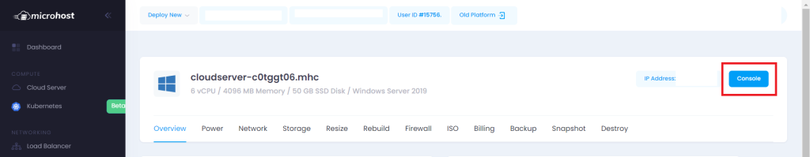
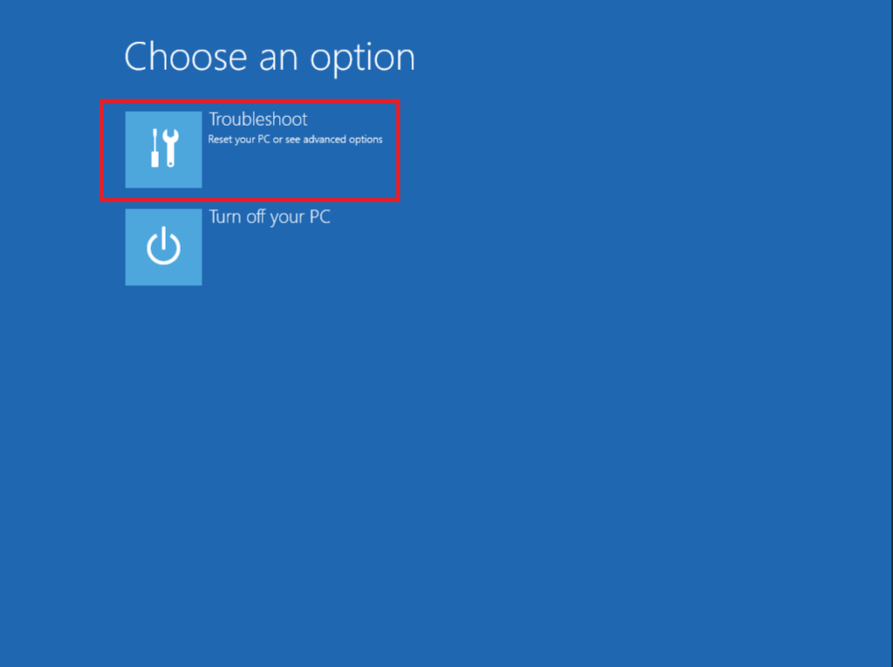
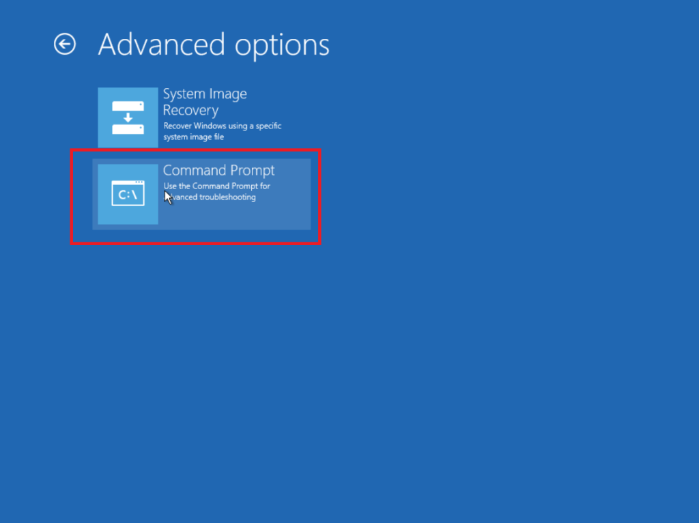
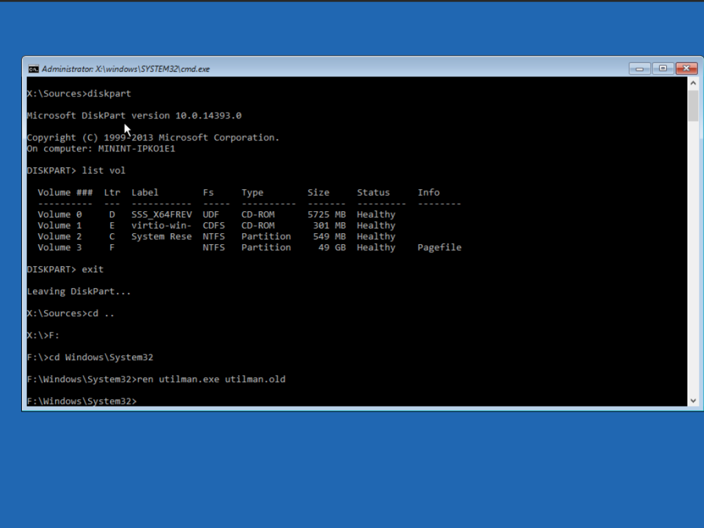

### INTRODUCTION

This blog will guide you to reset lost Administrator password in [Windows Servers](https://utho.com/docs/tutorial/how-to-connect-to-a-windows-server-using-remote-desktop-protocol-rdp/) 2012R2, 2016, 2019 and 2022.

An administrator account is a user account that grants you the ability to make changes that effect other users. Administrators have access to all data on the computer and can alter security settings, install software and hardware. Administrators can also make modifications to other user accounts, such as creating new local user accounts other than the administrator and giving the local user administrative capabilities.

###### Step 1. Login to [microhost.com](https://cloud.microhost.com/login) reset lost Administrator password

Step 2. Got to Manage

Step 3. Go to ISO section, and mount any other Windows Server ISO than your current OS version. Let's say we have Windows Server 2019 OS installed on our VM, so we will be mounting the OS of WIndows Server 2016. You can also do the vice versa.

Then click on **Mount and Boot from ISO**.

###### Step 4. Go to the console of the VM. reset lost Administrator password

Step 5. Power on and off the VM from the Microhost Manage Platform

Step 6. After powering on the VM from the panel, immediately go to the console and press escape to boot the VM with the ISO we just mounted. On the console we will find OS installation setup of the ISO we just mounted.

Step 7. Click Next on Windows Setup.

Step 8. Then click on Repair your computer.

Step 9. Click on Troubleshoot

**Step 10. Click on Command Prompt**

**Step 11. CMD will open. Now type Diskpart, which will tell us which volume does our OS exists on.**

**Step 12. exit diskpart and Go to Windows\\System32 in the volume where your old OS exists.** Volume F in our case.

**Step 13. Now we will rename the utiman.exe file.**

**Step 14.** Now we will copy cmd to utilman. (here we have replaced utilman with the command prompt in order to be able to reset our password)

**Step 15. Type exit in cmd and continue to boot the VM with our old Windows OS.**

**Step 16. Let the VM boot in our old Windows Server 2019 OS that we already had installed on our VM.**

**Step 17. On the console menu, we will go to ease of access.** Where cmd will open.

**Step 18.** Now we will run the following command to reset the Administartor's password.

> net user administrator Passw0rd

where **Passw0rd** is the new password that we need to set for the administrator.

The command says "The command completed successfully" means the password was reset successfully.

**Step 19.** Click exit. And login with the newly reset password of the administrator.

###### Step 20. Login with the new password. reset lost Administrator password

And we have successfully reset the lost password of the Administrator in your Windows Server.

**Thank You.**
