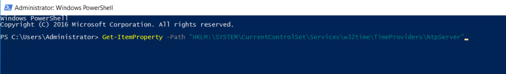
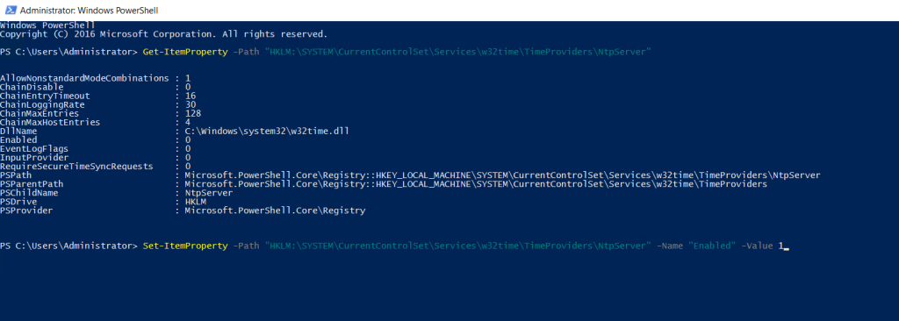

Step 1. Login to your [Windows Server](https://www.microsoft.com/en-in/windows-server)

Step 2. Open [Powershell](https://utho.com/docs/tutorial/how-to-change-rdp-port-via-powershell-in-windows-server/) as Administrator setup NTP Server for time synchronization


If the computer you want to configure is an Active Directory domain controller, the NTP server function is automatically enabled. Therefore, the following is an example of setting the NTP server function to Windows Server in a workgroup environment.

Step 3. Run the following command to check current settings

```
Get-ItemProperty -Path "HKLM:SYSTEMCurrentControlSetServicesw32timeTimeProvidersNtpServer"
```




Step 4. Run the following command to Enable NTP server function

```
Set-ItemProperty -Path "HKLM:SYSTEMCurrentControlSetServicesw32timeTimeProvidersNtpServer" -Name "Enabled" -Value 1
``` setup NTP Server for time synchronization



Step 5 . Change AnnounceFlags to 5

```
# Meaning of numbers

```

```
# 0x00 : Not a time server

```

```
# 0x01 : Always time server

```

```
# 0x02 : Automatic time server

```

```
# 0x04 : Always reliable time server

```

```
# 0x08 : Automatic reliable time server

```

```
Set-ItemProperty -Path "HKLM:SYSTEMCurrentControlSetservicesW32TimeConfig" -Name "AnnounceFlags" -Value 5
```


Step 6. Allow NTP port if Windows Firewall is running

```
New-NetFirewallRule `
```


```
-Name "NTP Server Port" `
-DisplayName "NTP Server Port" `
-Description 'Allow NTP Server Port' `
-Profile Any `
-Direction Inbound`
-Action Allow`
-Protocol UDP `
-Program Any`
-LocalAddress Any`
-LocalPort 123
```

Thank You!
