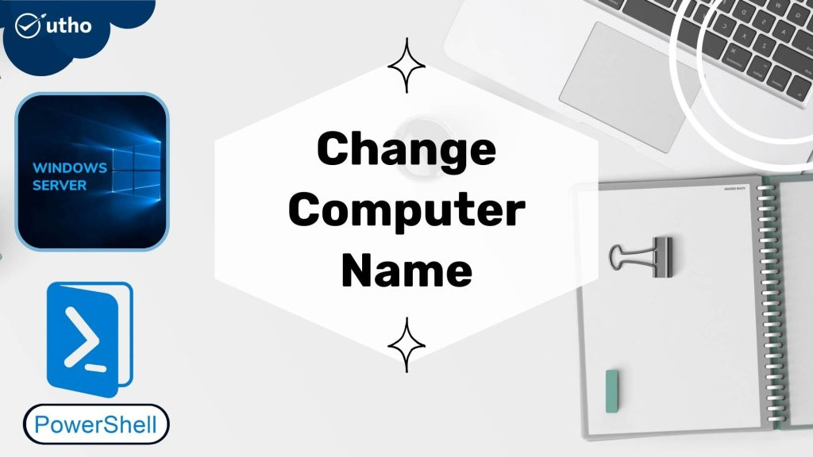

## INTRODUCTION Change Computer Name

Changing name of the computer/system is just a basic step to set a custom tag for your system. In this tutorial, we will learn how to Change Computer Name in Windows Server 2016, 2019 and 2022 via PowerShell.

#### Prerequisites

- [Windows Server](https://utho.com/docs/tutorial/how-to-install-active-directory-domain-service-on-windows-server/?preview_id=11159&preview_nonce=171803715d&preview=true)

- [PowerShell](https://learn.microsoft.com/en-us/powershell/) with Administrator rights

Step 1. Login to your Windows Server

Step 2. Open PowerShell as an Administrator


Step 3. Run the following command to \[rtestserver\]

```
Rename-Computer -NewName rtestserver -Force -PassThru
```


**Step 4. Run the following command to restart server and apply changes** Change Computer Name

```
Restart-Computer -Force
```


Server name changed.


Thank You!
