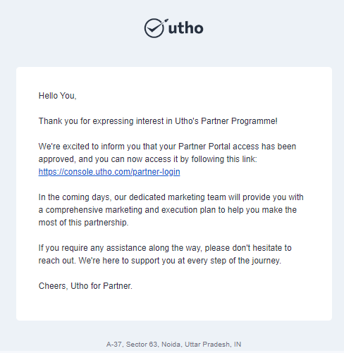
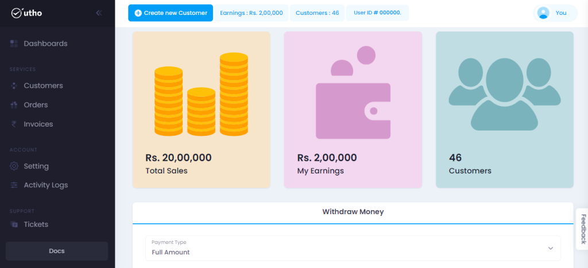

In this easy-to-follow document, we'll walk you through the steps to get started with Utho's Partner Portal.

**Step 1: Sign Up for an Account**

The journey begins with signing up for your Utho Partner Portal account.

Just follow the link to start your adventure: [https://console.utho.com/partner-signup.](https://console.utho.com/partner-signup)

**Step 2: Explore the Cloud Platform**

After you've successfully signed up, you'll be directed to our Cloud Platform.

Here, you have the power to test and deploy your cloud infrastructure.

It's like having your very own playground for innovation!

**Within 24 hours of signing up, our dedicated team will review and approve your partner portal request.**

**Step 3: Login to Partner Portal.**

Once our team approves the partner portal, you are now an official Utho partner.

You'll receive an **Email** and **WhatsApp message** with a login link that will take you straight to your Partner Portal.

**You can login to partner portal by this link.**

After logging in using this link, you will gain access to your partner portal.

Within this portal, you can efficiently manage orders, customers, and all aspects that enable the efficient management of your customer base.

**Step 4: Switch to Partner Mode**

If the partner login link doesn't directly redirect you to the partner portal, you can easily switch to the **partner mode** from within the portal.

These simple steps will assist you in gaining access to Utho's partner portal.

Facing any issue in getting started? Let our support team help you. Send us an email at **support@utho.com** and we'll take care of it for you.
