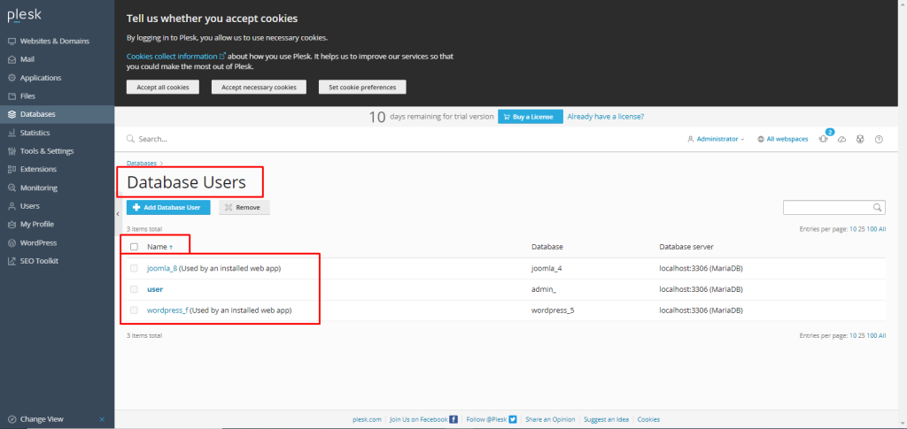

## Introduction

In this article, you will learn how to modify [Database user](https://utho.com/docs/tutorial/how-to-manage-user-roles-in-plesk/) privileges in [Plesk](https://en.wikipedia.org/wiki/Plesk).

Step 1. Enter your server password to get into your Plesk account, which can be found by searching your browser for server ip:8880.

Step 2. To manage users, go to the Databases menu on the left side of the screen, and choose User Management.

Step 3. Click on the name of the database user to change privileges.

Step 4. You will see the privileges section divided into data access and structure access.

Select the privilege you want to grant to the user, scroll the screen, and click on the OK button to save changes.

## Conclusion

Hopefully, now you have learned how to modify Database user privileges in Plesk.

Thank You 🙂
