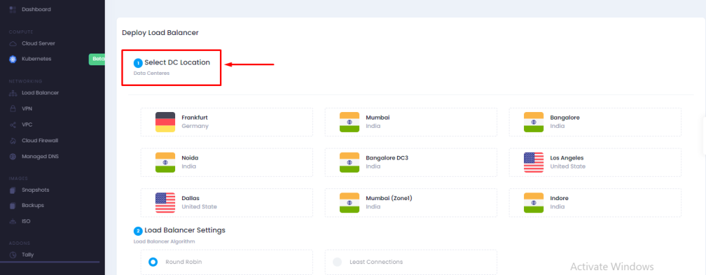
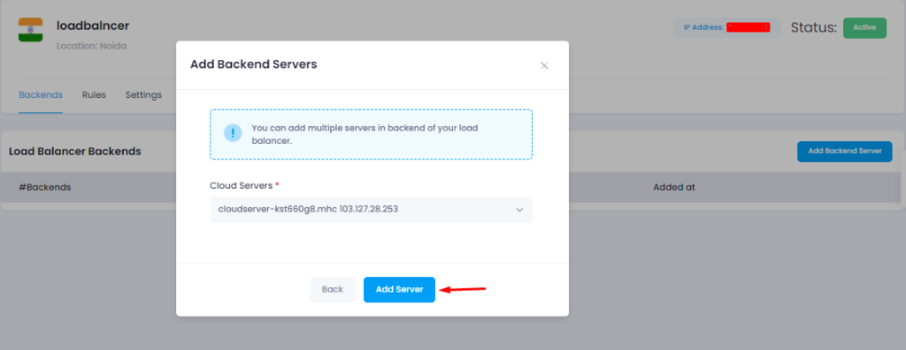

Load balancing is the process of distributing workloads/traffic across multiple computing resources. Load balancer is to save or protect a website from sudden outages. When the workload is distributed among various servers or network units, even if one node fails the burden can be shifted to another active node. It is used to maintain system firmness, improve system performance and to protect against system failures.

1. At first, you need to login [Microhost Cloud Dashboard](https://cloud.microhost.com/)
2. After successful login, we will move to the “Load Balancers” section as given in the screenshot .
3. In the "Load balancer" option, we have to click on “Add Load balancer” as given in the screenshot.

4\. Output will be shown as similar like given in the screenshot, where we have to write the DC location , load balancer setting(algorithm) and load balancer name .  

5\. After this click on create load balancer .Output will be shown as below-

In the backend section , you can choose the cloud server on which you want to apply the load balancer .  

In the rules section , you can manage (Add/Delete) the rules as per your requirement.

Thankyou.
