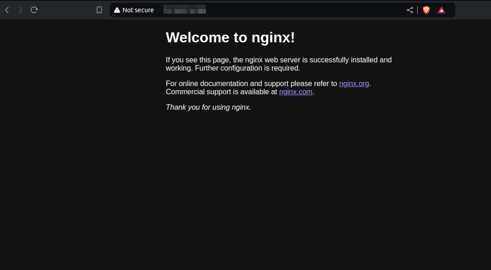

---

title: "Deployment Guide for Utho Cloud Load-Balancer Application Using Kubernetes and Helm"
date: "2024-11-15"
title_meta: "Utho Cloud Load-Balancer Deployment with Kubernetes and Helm"
description: "This guide provides a comprehensive step-by-step process to deploy a load-balancer application on Utho Cloud using Kubernetes and Helm, including configuration of the environment, installation of dependencies, and setup of a network load balancer."
keywords: ["Utho Cloud deployment", "Kubernetes Helm deployment", "Utho load balancer", "Kubernetes application setup"]
tags: ["Kubernetes", "Helm", "Utho Cloud", "Load Balancer"]
icon: "kubernetes"
lastmod: "2024-11-15T10:00:00+00:00"
draft: false
weight: 1
toc: true
tab: true

---

### **Deployment Guide for Utho Cloud Load-Balancer Application Using Kubernetes and Helm**

This document provides a step-by-step guide to configure and deploy an application on Utho Cloud using Kubernetes and Helm.

---

### **Prerequisites**
- Access to the **Utho Cloud UI**.
- Permissions to download the kubeconfig file.
- A target server with the **snap package manager** installed.

---

### **Deployment Steps**

#### **Step 1: Download the kubeconfig File**
1. Log in to the **Utho Cloud UI**.
2. Download the kubeconfig file to access your Kubernetes cluster.

---

#### **Step 2: Install `kubectl` on Your Target Server**
Install `kubectl` using the following command:

```bash
snap install kubectl --classic
```

---

#### **Step 3: Export the Kubeconfig File Path**
Set the kubeconfig file path to enable `kubectl` access to the cluster:

```bash
export KUBECONFIG=/root/kubeconfig
```

---


#### **Step 4: Deploy the NGINX Test Application and Loadbalancer**
Create a `deployment.yaml` file with the following content:

```yaml
---
apiVersion: v1
kind: Service
metadata:
  name: test
  annotations:
    # name of the loadbalancer
    service.beta.kubernetes.io/utho-loadbalancer-name: "k8s-lb-custom-name"
spec:
  type: LoadBalancer
  selector:
    app: test
  ports:
    - name: http
      port: 80
      targetPort: 80
---
apiVersion: apps/v1
kind: Deployment
metadata:
  name: test
  labels:
    app: test
spec:
  replicas: 2
  selector:
    matchLabels:
      app: test
  template:
    metadata:
      labels:
        app: test
    spec:
      containers:
        - name: test
          image: nginx:latest
          ports:
            - name: http
              containerPort: 80
              protocol: TCP
          imagePullPolicy: Always
```


1. Apply the deployment:

   ```bash
   kubectl apply -f deployment.yaml
   ```

2. Logs for review
   
```bash
for pod in $(kubectl get pods -n kube-system --no-headers -o custom-columns=":metadata.name" | grep '^utho-ccm'); do echo "Logs for pod: $pod"; kubectl logs -f -n kube-system "$pod" & done
```

3. Check Status of Loadbalancer IP
This may take upto 10 Minutes to assign loadbalancer IP.

```bash
kubectl get svc
```
---

#### **Step 13: Verify Application Functionality**
1. Check the URL and IP assigned in the Utho Cloud dashboard.
2. Access the service using the provided URL to confirm the application is running.


---

This concludes the deployment process for the Utho Cloud Load-Balancer.
