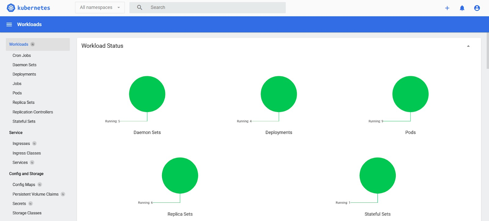
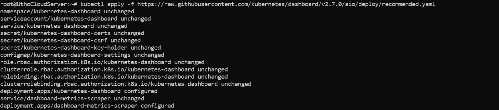
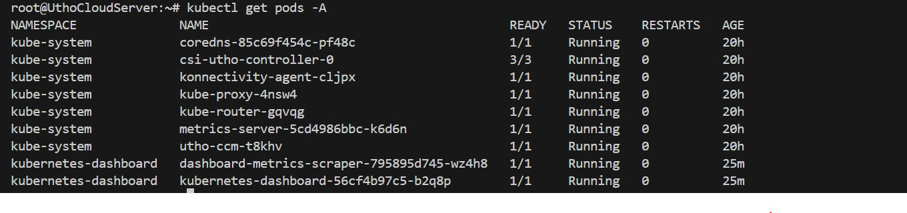
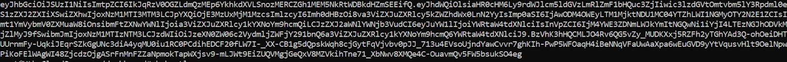
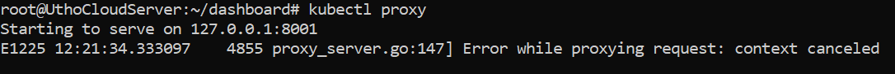
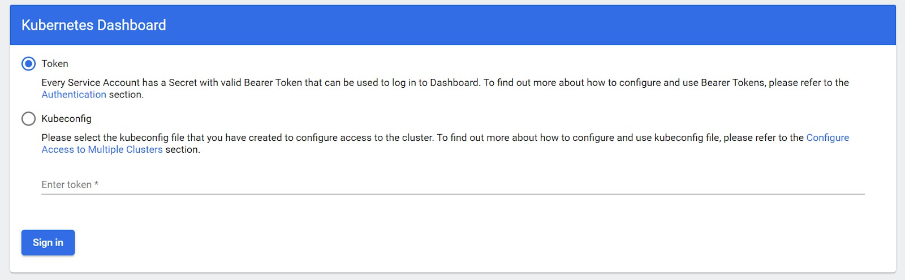
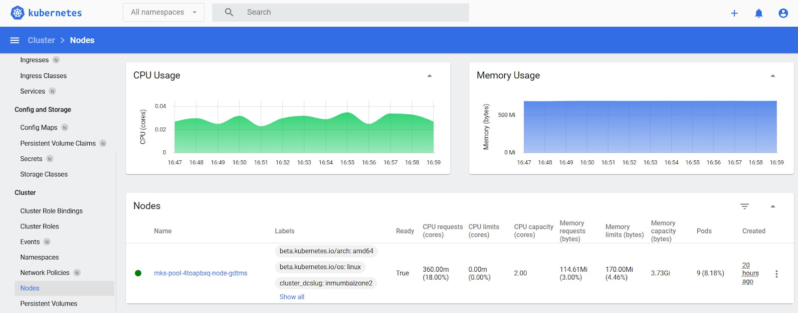

# How to Deploy Kubernetes Dashboard Quickly and Easily


Kubernetes provides an easy-to-use Web dashboard that allows users to create, monitor, and manage their clusters. While the installation process is simple, it requires a few steps to configure everything properly for seamless operation.

## To deploy the latest Kubernetes dashboard, follow these steps:

### Step 1
Run the following command to deploy the latest dashboard version:
```bash
kubectl apply -f https://raw.githubusercontent.com/kubernetes/dashboard/v2.0.0/aio/deploy/recommended.aml
```



Afterwards, you should have two new pods running on your cluster.
```bash
kubectl get pods -A
```



### Step 2: Creating Admin User
Start by making a new directory for the dashboard configuration files.
```bash
mkdir ~/dashboard && cd ~/dashboard
```

Create the configuration below and save it as a dashboard-admin.yaml file. Ensure that the indentation is correct, using two spaces in a text editor.
```bash
nano dashboard-admin.yaml
```

```yaml
apiVersion: v1
kind: ServiceAccount
metadata:
  name: admin-user
  namespace: kubernetes-dashboard
---
apiVersion: rbac.authorization.k8s.io/v1
kind: ClusterRoleBinding
metadata:
  name: admin-user
roleRef:
  apiGroup: rbac.authorization.k8s.io
  kind: ClusterRole
  name: cluster-admin
subjects:
- kind: ServiceAccount
  name: admin-user
  namespace: kubernetes-dashboard
```

After setting up the configuration, save the file. Then, apply the admin user role with the following command:
```bash
kubectl apply -f dashboard-admin.yaml
```

Get the admin token using the command below:
```bash
kubectl get secret -n kubernetes-dashboard $(kubectl get serviceaccount admin-user -n kubernetes-dashboard -o jsonpath="{.secrets[0].name}") -o jsonpath="{.data.token}" | base64 --decode
```

You'll then see an output of a long string of seemingly random characters.



### Step 3: Creating Read-Only User
```bash
nano dashboard-read-only.yaml
```

```yaml
apiVersion: v1
kind: ServiceAccount
metadata:
  name: read-only-user
  namespace: kubernetes-dashboard
---
apiVersion: rbac.authorization.k8s.io/v1
kind: ClusterRole
metadata:
  annotations:
    rbac.authorization.kubernetes.io/autoupdate: "true"
  labels:
  name: read-only-clusterrole
  namespace: default
rules:
- apiGroups:
  - ""
  resources: ["*"]
  verbs:
  - get
  - list
  - watch
- apiGroups:
  - extensions
  resources: ["*"]
  verbs:
  - get
  - list
  - watch
- apiGroups:
  - apps
  resources: ["*"]
  verbs:
  - get
  - list
  - watch
---
apiVersion: rbac.authorization.k8s.io/v1
kind: ClusterRoleBinding
metadata:
  name: read-only-binding
roleRef:
  kind: ClusterRole
  name: read-only-clusterrole
  apiGroup: rbac.authorization.k8s.io
subjects:
- kind: ServiceAccount
  name: read-only-user
  namespace: kubernetes-dashboard
```

Then, deploy the read-only user account using the command below:
```bash
kubectl apply -f dashboard-read-only.yaml
```

To allow users to log in via the read-only account, you'll need to provide a token which can be fetched using the next command:
```bash
kubectl get secret -n kubernetes-dashboard $(kubectl get serviceaccount read-only-user -n kubernetes-dashboard -o jsonpath="{.secrets[0].name}") -o jsonpath="{.data.token}" | base64 --decode
```

### Step 4: Accessing the Dashboard
We've deployed the dashboard and created user accounts for it. Next, we can start managing the Kubernetes cluster itself.
```bash
kubectl proxy
```



You can access Dashboard at:
http://localhost:8001/api/v1/namespaces/kubernetes-dashboard/services/https:kubernetes-dashboard:/proxy/

If everything is running correctly, you should see the dashboard login window.



Choose the token authentication method and paste your admin token in the provided field.

Then, click the Sign In button. You will be directed to the overview of your Kubernetes cluster.


