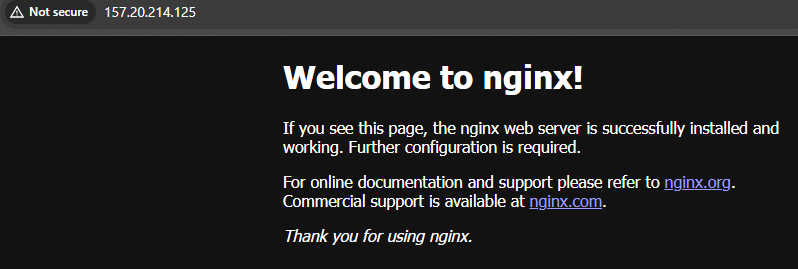

---

title: "Deploying and Exposing Nginx & Banner Pods with Custom Services"
date: "2025-03-3T17:25:05+01:00"
title_meta: "Deploying and Exposing Nginx & Banner Pods with Custom Services"
description: "This document provides step-by-step instructions for Deploying and Exposing Nginx & Banner Pods with Custom Services"
keywords: ["Kubernetes", "kubectl", "application deployment", "Kubernetes cluster", "YAML configuration", "kubectl apply", "Banner", "Exposing", "LoadBalancer", "", "DevOps"]
tags: ["Kubernetes", "Banner Pods", "DevOps", "YAML", "kubectl", "LoadBalancer"]
lastmod: "2025-03-3T17:25:05+01:00"
aliases: ["/kubernetes/Deploying-and-Exposing-Nginx-&-Banner-Pods-with-Custom-Services"]
icon: "kubernetes"
draft: false
weight: 1
toc: true
tab: true

---
# **Deploying and Exposing Nginx & Banner Pods with Custom Services**

## **Prerequisites**

- A running Kubernetes cluster.
- `kubectl` configured to interact with your cluster.
- Docker installed for building custom images (if needed).

## **1. Deploying the Nginx Pod**

Nginx is a widely used web server and reverse proxy. We will deploy an Nginx pod with a LoadBalancer service to expose it externally.

### **Create the Deployment File**

Create a file named `nginx-deployment.yaml`:
```sh
vi nginx-deployment.yaml
```

```yaml
apiVersion: apps/v1
kind: Deployment
metadata:
  name: nginx-deployment
spec:
  replicas: 2
  selector:
    matchLabels:
      app: nginx
  template:
    metadata:
      labels:
        app: nginx
    spec:
      containers:
      - name: nginx
        image: nginx:latest
        ports:
        - containerPort: 80
```

### **Create the Service File**

Create a file named `nginx-service.yaml`:

```sh
vi nginx-service.yaml
```

```yaml
apiVersion: v1
kind: Service
metadata:
  name: nginx-service
spec:
  selector:
    app: nginx
  ports:
  - protocol: TCP
    port: 80
    targetPort: 80
  type: LoadBalancer
```

### **Deploying Nginx**

Run the following commands to deploy Nginx:

```sh
kubectl apply -f nginx-deployment.yaml
kubectl apply -f nginx-service.yaml
```

## **2. Deploying the Banner Pod**

The Banner application is a simple Flask-based web service that returns a welcome message.

### **Create the Python Application**

Create a file named `app.py`:

```sh
vi app.py
```

```python
from flask import Flask

app = Flask(__name__)

@app.route("/")
def home():
    return "🚀 Welcome to the Banner App!"

if __name__ == "__main__":
    app.run(host="0.0.0.0", port=8000)
```

### **Create the Deployment File**

Create a file named `banner-deployment.yaml`:

```sh
vi banner-deployment.yaml
```

```yaml
apiVersion: apps/v1
kind: Deployment
metadata:
  name: banner-deployment
spec:
  replicas: 2
  selector:
    matchLabels:
      app: banner
  template:
    metadata:
      labels:
        app: banner
    spec:
      containers:
      - name: banner
        image: bharatnoidawala/banner-app:v2 #replace this with your docker image.
        ports:
        - containerPort: 8000
```

### **Create the Service File**

Create a file named `banner-service.yaml`:

```sh
vi banner-service.yaml
```

```yaml
apiVersion: v1
kind: Service
metadata:
  name: banner-service
spec:
  selector:
    app: banner
  ports:
  - protocol: TCP
    port: 8000
    targetPort: 8000
  type: LoadBalancer
```

### **Deploying the Banner App**

Run the following commands to deploy the Banner application:

```sh
kubectl apply -f banner-deployment.yaml
kubectl apply -f banner-service.yaml
```

## **3. Verifying the Deployments**

### **Checking Service Status**

Run the following command to check the status of services:

```sh
kubectl get svc
```

#### **Expected Output:**

```
NAME             TYPE           CLUSTER-IP       EXTERNAL-IP   PORT(S)          AGE
banner-service  LoadBalancer   10.104.32.254    <External-IP>  8000:30289/TCP   2h
nginx-service   LoadBalancer   10.109.195.33    <External-IP>  80:32060/TCP     2h
```

### **Testing the Deployments**

Once deployed, you can test the applications by accessing their external IPs.

#### **Accessing Nginx**

```sh
curl http://<nginx-external-ip>:80
```



#### **Accessing the Banner App**

```sh
curl http://<banner-external-ip>:8000
```


## **Conclusion**

You have successfully deployed and exposed Nginx and a custom Banner Flask application on Kubernetes using LoadBalancer services. This setup allows efficient traffic routing and ensures both applications are accessible externally. If needed, you can further enhance this setup by implementing Ingress controllers for better traffic management.
