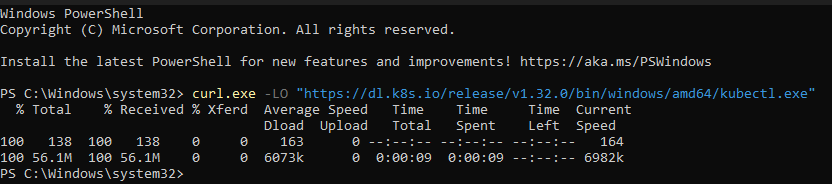
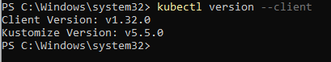
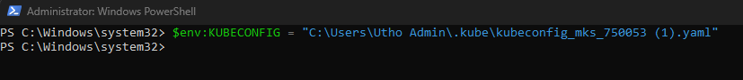
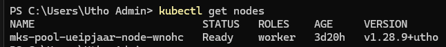

---

title: "Kubectl Installation and Cluster Access Verification on Windows"
date: "2025-02-03T17:25:05+01:00"
title_meta: "Kubectl Installation and Cluster Access Verification on Windows"
description: "This document provides step-by-step instructions for installing kubectl on Windows, configuring your environment, and verifying access to a Kubernetes cluster."
keywords: ["Kubernetes", "kubectl", "Windows installation", "cluster access", "Kubernetes cluster", "kubectl apply", "installation steps", "configuration", "authentication"]
tags: ["Kubernetes", "Kubectl", "Windows", "Cluster Access", "DevOps", "Configuration"]
lastmod: "2025-02-03T17:25:05+01:00"
aliases: ["/kubernetes/Kubectl-Installation-and-Cluster-Access-Verification-on-Windows"]
icon: "kubernetes"
draft: false
weight: 1
toc: true
tab: true

---

# **Kubectl Installation and Cluster Access Verification on Windows**

## **Step 1: Download and Install kubectl**

1.  Open PowerShell or Command Prompt.

Run the following command to download the kubectl binary:
```bash
curl.exe -LO "https://dl.k8s.io/release/v1.32.0/bin/windows/amd64/kubectl.exe"
```



## **Step 2: Verify kubectl Installation**

Verify that kubectl is installed by running:
```bash
kubectl version --client
```



-   This should display the client version of kubectl.

## **Step 3: Place kubeconfig File**

1.  Locate your kubeconfig file (e.g., kubeconfig.yaml).

2.  Place the file in the .kube directory on your system.

    -   Example path: C:\\path\\to\\your\\kubeconfig

## **Step 4: Set KUBECONFIG Environment Variable**

1.  Open PowerShell.

Set the kubeconfig file as an environment variable by running:
```bash
$env:KUBECONFIG = "C:\\path\\to\\your\\kubeconfig\"
```



## **Step 5: Verify Access to the Kubernetes Cluster**

Verify access to the cluster using:
```bash
kubectl get nodes
```


-   This should display the nodes in your Kubernetes cluster.

## **Notes**

-   Ensure that your kubeconfig file contains the correct cluster
     credentials and configurations.

-   If any issues arise, confirm that the cluster is reachable from your
    machine.

Thank You!