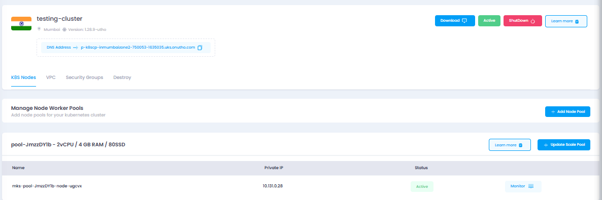
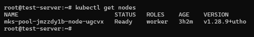
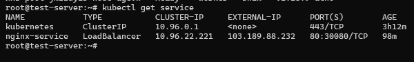

---

title: "How to Deploy an Application on a Kubernetes Cluster"
date: "2025-01-26T17:25:05+01:00"
title_meta: "How to Deploy an Application on a Kubernetes Cluster"
description: "This document provides step-by-step instructions for deploying an application on a Kubernetes cluster, including setting up the necessary configurations and verifying successful deployment."
keywords: ["Kubernetes", "kubectl", "application deployment", "Kubernetes cluster", "YAML configuration", "kubectl apply", "deployment", "service", "LoadBalancer", "Helm", "DevOps"]
tags: ["Kubernetes", "Application Deployment", "DevOps", "YAML", "kubectl", "LoadBalancer", "Helm"]
lastmod: "2025-01-26T17:25:05+01:00"
aliases: ["/kubernetes/how-to-deploy-application-on-kubernetes"]
icon: "kubernetes"
draft: false
weight: 1
toc: true
tab: true

---

# How to Deploy an Application on a Kubernetes Cluster

This document provides step-by-step instructions for deploying an
application on a Kubernetes cluster.

## **Step 1: Prerequisites**

Ensure the following are set up before proceeding:

- Kubernetes cluster is up and running.
- kubectl is configured to interact with your cluster.
- Docker image of your application is available in a container registry
(e.g., Docker Hub).

- Proper access to the cluster and namespace (if using role-based access
control).

First of all deploy a kubernetes cluster download its config file and

export it on your local server with command:-
```bash
export KUBECONFIG=test.yml
```


After that install the kubectl packages with command:-
```bash
snap install kubectl --classic
```
```bash
Kubectl get nodes
```
You will see your connected nodes on server


## **Step 2: Create a Deployment YAML**

Create a YAML file for your application's Deployment. Below is an

example for an application using the nginx image:

Save this file as `deployment.yaml`:

```yaml
apiVersion: apps/v1
kind: Deployment
metadata:
  name: nginx-deployment
spec:
  replicas: 2
  selector:
    matchLabels:
      app: nginx
  template:
    metadata:
      labels:
        app: nginx
    spec:
      containers:
        - name: nginx
          image: nginx:latest
          ports:
            - containerPort: 80
 ```


## **Step 3: Create a Service YAML**

To expose your application, create a Service YAML file. For a

LoadBalancer:

Save this file as `service.yaml`:

```yaml
apiVersion: v1
kind: Service
metadata:
  name: nginx-service
spec:
  selector:
    app: nginx
  ports:
    - protocol: TCP
      port: 80
      targetPort: 80
  type: LoadBalancer

  ```


## **Step 4: Deploy Resources to Kubernetes**

Apply the Deployment YAML:

```bash
kubectl apply -f deployment.yaml
```
Apply the Service YAML:

```bash
kubectl apply -f service.yaml
```
## **Step 5: Verify the Deployment**

Check the status of your Deployment:
```bash
kubectl get deployments
```
Example output:

NAME READY UP-TO-DATE AVAILABLE AGE\

nginx-deployment 2/2 2 2 5m

Check the status of the Service:
```bash
kubectl get services
```
Example output:



NAME TYPE CLUSTER-IP EXTERNAL-IP PORT(S) AGE\

nginx-service LoadBalancer 10.96.22.221 103.189.88.232 80:30080/TCP 5m

## **Step 6: Access the Application**

If you created a LoadBalancer Service, find the EXTERNAL-IP from the

Service output.

Open your browser or use curl to access the application:

http://EXTERNAL-IP:80

Example output:

![][def]

If successful, you should see the application's welcome page (e.g.,

Nginx default page).

## **Step 7: Troubleshooting**

Check pod status if something isn\'t working:
```bash
kubectl get pods
```
Example output:

NAME READY STATUS RESTARTS AGE\

nginx-deployment-7c79c4bf97-w8md8 1/1 Running 0 5m

Describe the pod for detailed logs:
```bash
kubectl describe pod POD-NAME
```
Review logs of the pod:
```bash
kubectl logs <POD-NAME>
```
Check the Events section in your Service or Deployment description:
```bash
kubectl describe svc nginx-service
```
```bash
kubectl describe deployment nginx-deployment
```
## **Step 8: Cleanup (Optional)**

If you want to remove the deployment and service:

Delete the Deployment:
```bash
kubectl delete -f deployment.yaml
```
Delete the Service:
```bash
kubectl delete -f service.yaml
```
Thank You!


[def]: ./images/image4.png