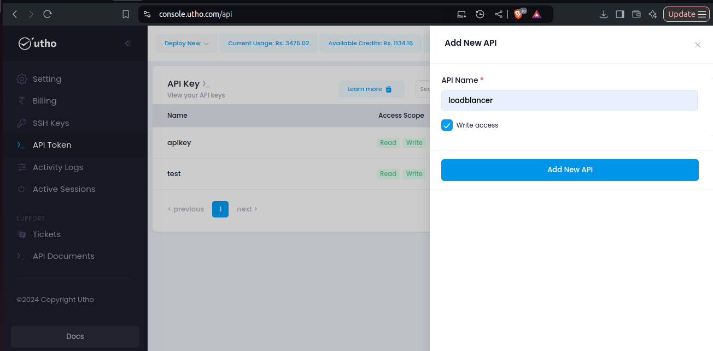
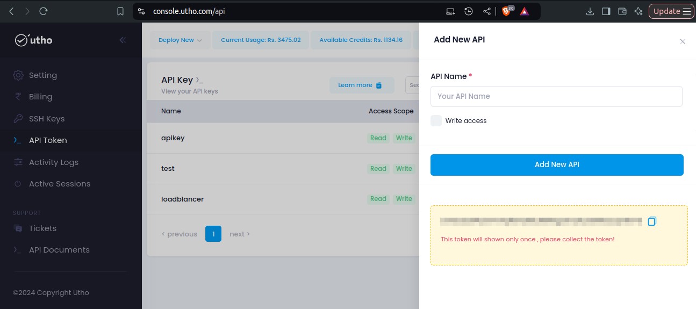

---

title: "Nginix Ingress with kubernetes cluster"
date: "2024-12-10"
title_meta: "Nginix Ingress with kubernetes cluster"
description: "This guide provides a comprehensive step-by-step approach to setting up Nginx Ingress with a Kubernetes cluster. It includes configuration of Utho CSI, deployment of persistent storage, and verification of resources for seamless integration of ingress and storage solutions."
keywords: ["Utho","Utho Cloud","Kubernetes", "Nginx Ingress", "kubectl", "StorageClass", "pod deployment", "Kubernetes cluster", "YAML configuration", "Utho CSI", "Persistent Storage", "Kubernetes pod", "Helm Chart", "Ubuntu", "Snap installation", "PersistentVolumeClaim"]
tags: ["Kubernetes", "StorageClass", "Utho Cloud", "Nginx", "Ingress", "Utho CSI", "PersistentVolume", "Helm", "DevOps"]
icon: "kubernetes"
lastmod: "2024-12-10T10:00:00+00:00"
draft: false
weight: 1
toc: true
tab: true

---

## **Nginix Ingress with kubernetes cluster**

This document provides a step-by-step guide to configure Nginx Ingress with a Kubernetes cluster.

---

### **Prerequisites**
- Access to the **Utho Cloud UI**.
- A working Kubernetes cluster.
- **Nginx** installed and configured.
- Access to **kubectl** and **Helm CLI** tools on your local machine.
- A valid Utho **API Key**.
- Sufficient permissions to manage Kubernetes resources.

---
### **Deployment Steps**

### **Step 1: Installing `kubectl` Using Snap**

 The simplest way to install kubectl on your Ubuntu system is by using
 Snap. Here’s how to do it:

#### 1\. Install kubectl via `Snap`:

 Run the following command to install kubectl:

```bash
sudo snap install kubectl --classic
```
---

#### 2\. Verify Installation `version`:

 To verify that kubectl has been installed correctly,check the version
 of the client using the command below:
```bash
 kubectl version --client
```
 Download the cluster file from k8s cluster

#### 3\.  How to Transfer `Cluster File`:
If you want to transfer cluster file from Linux to Linux.

```bash
 sudo rsync -av kubeconfig_mks_749759.yaml root@<server-ip>:~/kubeconfig_mks_749759.yaml
```
----
### **Step 2: Configuring Access to Your Kubernetes**

 To access and manage your Kubernetes cluster, you need to configure
 kubectl with the cluster configuration file `(kubeconfig)`.

#### 1\. Set the `KUBECONFIG` environment variable:

 Assuming the Kubernetes config file is located at /root/kubeconfig_mks_749759.yaml, use the
following command to point kubectl to the correct configuration file:

```bash
 export KUBECONFIG=/root/kubeconfig_mks_749759.yaml
```
---
#### 2\. Verify `Cluster` Connection:

 To ensure you’re connected to the cluster, run:

```bash
 kubectl cluster-info
```
---
### **Step** **3:** **Checking** **Running** `Pods` **in** **the** **Kubernetes**

#### 1\. Check Pods:

 To see the pods running in your Kubernetes cluster, use the following
 command:

```bash
 kubectl get nodes
```

```bash
 kubectl get pods --all-namespaces
```

 This command will list all running pods in every namespace.

---


```bash
 kubectl get pods
```
This command will show staus of running pods.


### Step 4: Clone and Setup Repository

Clone the Utho `CSI` repository and navigate to the deployment directory:

```bash
git clone https://github.com/uthoplatforms/csi-utho\
cd csi-utho/deploy/
```

Ensure no conflicting `OpenEBS` resources exist before proceeding:
```bash
kubectl delete namespace openebs\
```
```bash
kubectl delete crds -l openebs.io/crd-group=openebs
```

### **Step 5: Create an API Key**
1. In the Utho Console, navigate to the **API Token** section.



2. Click **Create API Key**.
3. Configure the API:
   - Enter a name for the API.
   - Set the permission level to **Write**.
4. Click **Add new API** to generate the key.



5. Copy and save the API key for future use.

---
### Step 6: Create Utho API Secret
Replace `<API_KEY>` with your Utho API Access Token and save the following as secret.yml:
```yaml
apiVersion: v1
kind: Secret
metadata:
  name: csi-utho
  namespace: kube-system
stringData:
  api-key: "<API_KEY>"
```

Apply the secret:

```bash
kubectl create -f ./secret.yml
```
### Step 7: Deploy the CSI Plugin

Deploy the `CSI` plugin and its sidecars:
```bash
kubectl apply -f latest.yml
```
### Step 8: Recreate Resources

#### 1. Create a StorageClass

Example `YAML` for a `StorageClass`:
```yaml
apiVersion: storage.k8s.io/v1
kind: StorageClass
metadata:
  name: utho-block-storage
provisioner: csi.storage.k8s.io
volumeBindingMode: Immediate
```
Apply the StorageClass:
```bash
kubectl apply -f storageclass.yaml
```
#### 2. Create a PersistentVolume (Static Provisioning)

Example `YAML` for a `PersistentVolume`:
```yaml
apiVersion: v1
kind: PersistentVolume
metadata:
  name: utho-pv
spec:
  capacity:
    storage: 10Gi
  accessModes:
    - ReadWriteOnce
  storageClassName: utho-block-storage
  persistentVolumeReclaimPolicy: Retain
  hostPath:
    path: /mnt/data
```
Apply the PersistentVolume:
```bash
kubectl apply -f persistentvolume.yaml
```
#### 3. Create a `PersistentVolumeClaim`

Example YAML for a PersistentVolumeClaim:
```yaml
apiVersion: v1
kind: PersistentVolumeClaim
metadata:
  name: csi-utho-pvc
spec:
  accessModes:
    - ReadWriteOnce
  resources:
    requests:
      storage: 10Gi
  storageClassName: utho-block-storage
```
Apply the `PVC`:
```bash
kubectl apply -f pvc.yaml
```
### Step 9: Verify Resources

Verify that resources are properly configured and bound:

Check `PVC` Status:
```bash
kubectl get pvc csi-utho-pvc
```
Check `PV` Status:
```bash
kubectl get pv
```
Check `StorageClass`:
```bash
kubectl get storageclass
```
Check Kubernetes Events (Optional):
```bash
kubectl get events \--sort-by=\'.lastTimestamp\'
```

### Step 10: Deploy Ingress NGINX

Install the Ingress `NGINX` Helm Chart:
```bash
helm repo add ingress-nginx https://kubernetes.github.io/ingress-nginx\
```
```bash
helm repo update\
```
```bash
helm install ingress-nginx ingress-nginx/ingress-nginx -f values.yaml
```
Check Ingress `NGINX` Pods:
```bash
kubectl get pods -n ingress-nginx
```