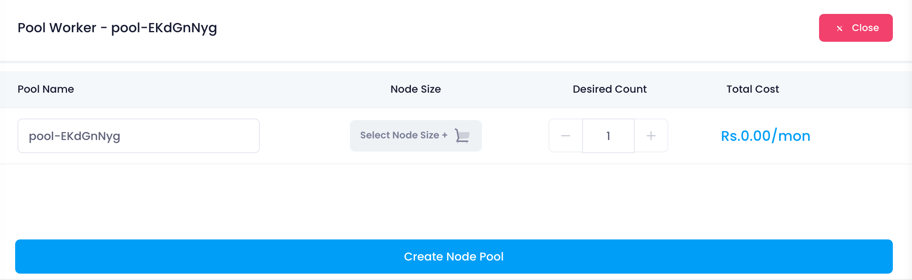
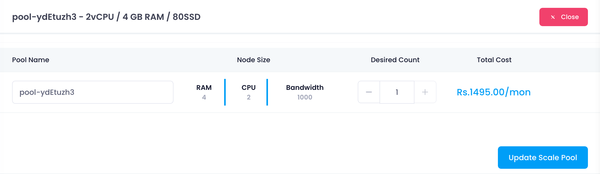

**Adding Node Pools:** If your application or workload requires different configurations, click on the "Add node pool" button to create additional node pools with varying specifications.

1. **Node Pool Configuration:**

   * A node pool represents a group of nodes within a Kubernetes cluster that all have the same configuration. Configure your node pool(s) with the following details:
     * **Pool Name:** Provide a name for the node pool to distinguish it from others.
     * **Node Size:** Select the size (CPU and memory configuration) for nodes within this pool.
     * **Desired Count:** Specify the initial number of nodes you want in this pool.
2. **Selecting Node Size:**

   * Click on the "Node Size" option to view available plans. A drawer will open displaying various plans with detailed specifications (CPU, memory, storage).

**List Node Pools:**

here user can view the node pool list attached with the kubernetes cluster

**Update Node Pool Configuration:**

when user click on **Open scale pool** then this node pool configuration will open where you can update the node pool

* Update  your node pool(s) configuration with the following details:
  * **Pool Name:** Provide a name for the node pool to distinguish it from others.
  * **Node Size:** Select the size (CPU and memory configuration) for nodes within this pool.
  * **Desired Count:** Specify the initial number of nodes you want in this pool
